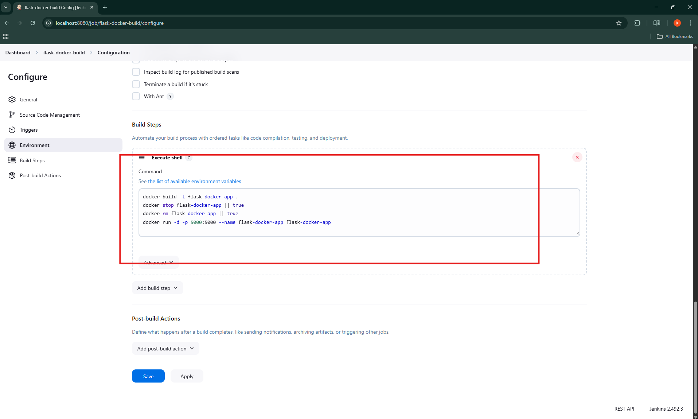
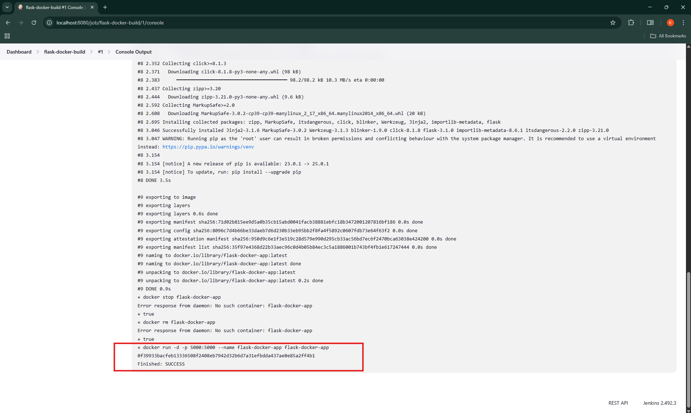
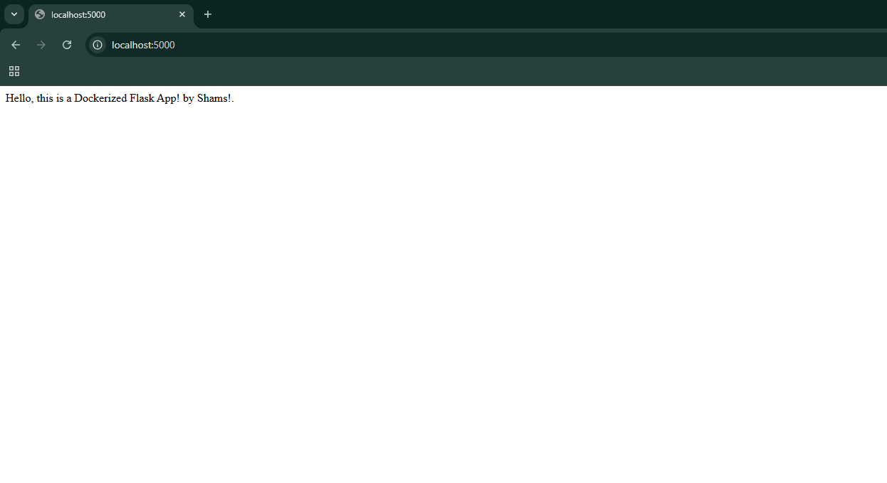

# Jenkins + Docker CI/CD Pipeline 🚀

This project demonstrates a CI/CD pipeline using **Jenkins** to automate the Docker build and deployment process for a simple **Flask web app**.

---

## 💡 Project Summary

- ✅ Pulls code from GitHub
- ✅ Builds a Docker image
- ✅ Deploys container on localhost
- ✅ Uses Jenkins Freestyle Job

---

## 🧰 Tools Used

- Jenkins
- Docker
- Git & GitHub
- Flask (Python)
- Linux (Ubuntu)

---

## 📸 Screenshots

### Jenkins Job Setup


### Build Console Output


### App Running on Browser


---

## 🔁 How to Run Locally

```bash
# Clone this repo
git clone https://github.com/k-shamsuddin/jenkins-docker-cicd.git

# Navigate into project
cd jenkins-docker-cicd

# Start Jenkins (if not running)
docker run -p 8080:8080 -p 50000:50000 --name jenkins \
  -v jenkins_home:/var/jenkins_home \
  -v /var/run/docker.sock:/var/run/docker.sock \
  jenkins/jenkins:lts
```

🧠 What I Learned

- End-to-end Jenkins Job creation

- Jenkins + Docker socket integration

- Automated CI/CD for containerized apps

- Troubleshooting Jenkins errors

✨ Author

Khaja Shamsuddin Ahmed
